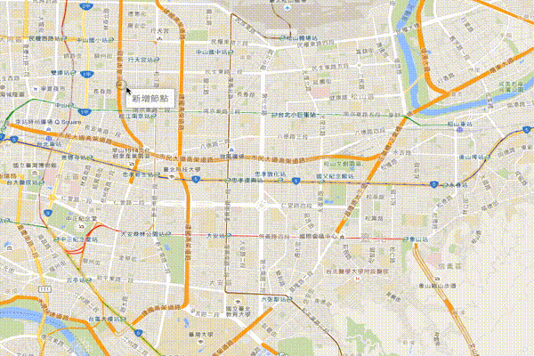

# Welcome To OA's point in polygon demo!
一個 Google Maps API point in polygon demo.

---
## Demo

 
## 聲明
本作品授權採用 姓名標示-非商業性 2.0 台灣 (CC BY-NC 2.0 TW) 授權，詳見 [http://creativecommons.org/licenses/by-nc/2.0/tw/](http://creativecommons.org/licenses/by-nc/2.0/tw/)

 
## 簡介
* 就是一個多邊形，拉出範圍，選出範圍內的項目。

 
## 安裝
* hosts 設定一個 domain
* vhost 將該 domain 指向專案
* 設定 `application/config/database.php` 資料庫選項
* 建立資料表，執行 `application/controllers/main.php` 的 **init** method
* 產生 Demo 用的資料夾，執行 `application/controllers/main.php` 的 **demo** method
* 開啟 domain，即可看到功能，對地圖點選右鍵即可新增節點，三個節點以上才能透過 **Ajax** 撈取項目

 
## 關於
* 作者名稱 - [OA Wu](http://www.ioa.tw/)

* E-mail - <comdan66@gmail.com>

* 作品名稱 - OA's point in polygon demo

* 最新版本 - 1.0

* GitHub - [OA's point in polygon demo](https://github.com/comdan66/point-in-polygon)

* 更新日期 - 2015/11/27